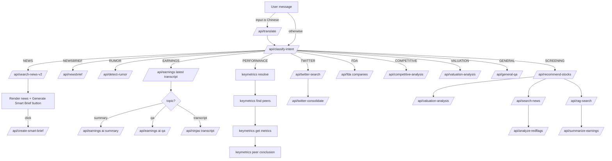

# EquityResearch

## Environment files

- Server runtime (`server/index.ts`) uses `import "dotenv/config"` which loads only `.env` by default.
- Playwright tests (`tests/playwright.config.ts`) load `.env.local` first, then fall back to `.env`.

If you want the server to read `.env.local`, add an explicit `dotenv.config({ path: ".env.local" })` before `dotenv/config` or replace the import with a custom load order.

## Local development

- Install deps: `npm install`.
- Create `.env` (or use your shell env vars). Optional keys used by the server include `OPENAI_API_KEY`, `DEEPSEEK_API_KEY`, `PERPLEXITY_API_KEY`, and `VALUATION_API_URL`. If keys are missing, related routes fall back or return 503.
- Start the dev server: `npm run dev`.
- Open the app at `http://localhost:5173`.

## Testing & Reports

- Local test runs load `.env.local` first, then `.env` (see `tests/playwright.config.ts`).

- Unit tests (Vitest): `npm run test:unit:report`, outputs `test-results/vitest-unit.json` and `test-results/vitest-unit.html`.
- E2E Mock (no network, `MOCK_API=1`): `npm run test:e2e:mock:report`, outputs `test-results/playwright-mock.json` and `test-results/playwright-mock-report`. Mock suite lives in `tests/e2e/api.mock.spec.ts` (plus `modules.spec.ts`, `app.spec.ts`).
- E2E Real (requires network + API keys): `npm run test:e2e:real:report`, outputs `test-results/playwright-real.json` and `test-results/playwright-real-report`. Real suite lives in `tests/e2e/api.real.spec.ts` (plus `modules.spec.ts`, `app.spec.ts`). Configure `.env.local`/`.env` with `DEEPSEEK_API_KEY`/`OPENAI_API_KEY`/`PERPLEXITY_API_KEY`/`VALUATION_API_URL`; unreachable services are marked skipped.
- Full flow: `npm run test:flow` runs unit → E2E Mock → E2E Real and writes reports to `test-results/`.
- Clean + full run (no reports): `npm run test:clean && npm run test:all`
- Quick run (no reports):
  - Unit only: `npm run test`
  - E2E mock only: `npm run test:e2e:mock` (api.mock + modules + app)
  - E2E real only: `npm run test:e2e:real` (api.real + modules + app)
  - All (unit → mock → real): `npm run test:all`
- Clean all test results: `npm run test:clean`
- Playwright artifacts output to `test-results/artifacts` to avoid collisions with HTML report directories.
- Real E2E API responses are stored in `test-results/api-real/*.json`.
- Install test deps: `npm install` (already includes Vitest, Supertest, Playwright, dotenv, etc.). If Playwright browser deps are missing on Manjaro/Arch: `sudo pacman -S --needed icu libxml2 libvpx flite nss libxss at-spi2-core gtk3 libdrm libxkbcommon libxrandr mesa libxrender libxi libxtst alsa-lib cups dbus ttf-liberation pango cairo`. To download browsers: `npx playwright install`.

## Testing Principles

- Unit tests (Vitest + Supertest)
  - Create the Express app with `registerRoutes(app)`, then call each `/api/*` route via Supertest to validate input checks and fallback behavior when external dependencies are missing.
  - External calls are stubbed or conditionally short-circuited (for example, FDA fetch is stubbed; DeepSeek/Perplexity without keys return 503/defaults). Data is truncated in the route layer so no real outbound requests happen.

- E2E tests (Playwright)
  - Mock mode: set `MOCK_API=1`, backend routes return built-in fake data without network access; Playwright validates UI and API through request + browser flows.
  - Real mode: set `REAL_API_TEST=1` with keys; Playwright hits the running dev server (auto-started by config). DeepSeek/Perplexity/OpenAI/valuation/FDA run only if configured/reachable; otherwise tests are marked skipped in reports.
  - Data cutoff: Mock mode returns in-route JSON; Real mode sends real outbound requests (or skips when unreachable) with no extra frontend interception.

## Interface Coverage Map (by module)

Legend:

- E2E (frontend flow): `tests/e2e/modules.spec.ts`
- E2E (API mock): `tests/e2e/api.mock.spec.ts`
- E2E (API real): `tests/e2e/api.real.spec.ts`
- Unit (routes): `tests/unit/routes.test.ts`

### Frontend direct-connect interfaces (as in `client/src/pages/home.tsx`)

| Interface                                                                 | Module      | E2E (frontend flow)                                                                                                       | E2E (API mock/real) | Unit | Notes             |
| ------------------------------------------------------------------------- | ----------- | ------------------------------------------------------------------------------------------------------------------------- | ------------------- | ---- | ----------------- |
| `/api/search-news-v2`                                                     | News        | `News module hits search-news-v2 and create-smart-brief`                                                                  | -                   | -    | SmartNews direct  |
| `/api/create-smart-brief`                                                 | News        | `News module hits search-news-v2 and create-smart-brief`                                                                  | -                   | -    | SmartNews direct  |
| `/api/detect-rumor`                                                       | Rumor       | `Rumor module hits detect-rumor`                                                                                          | -                   | -    | SmartNews direct  |
| `/api/newsbrief`                                                          | News Brief  | `News brief module hits newsbrief`                                                                                        | -                   | -    | SmartNews direct  |
| `/api/search-news`                                                        | Screening   | `Screening module hits recommend-stocks and follow-up APIs`                                                               | -                   | -    | SmartNews direct  |
| `/api/rag-search`                                                         | Screening   | `Screening module hits recommend-stocks and follow-up APIs`                                                               | -                   | -    | SmartNews direct  |
| `/api/earnings/latest-transcript/:ticker`                                 | Earnings    | `Earnings summary uses latest-transcript and ai-doc` + `Earnings transcript uses latest-transcript and ninjas/transcript` | -                   | -    | SmartNews direct  |
| `/api/earnings/ai-doc?docType=summary`                                    | Earnings    | `Earnings summary uses latest-transcript and ai-doc`                                                                      | -                   | -    | SmartNews direct  |
| `/api/earnings/ai-doc?docType=qa`                                         | Earnings    | `Earnings Q&A uses ai-doc qa`                                                                                             | -                   | -    | SmartNews direct  |
| `/api/ninjas/transcript`                                                  | Earnings    | `Earnings transcript uses latest-transcript and ninjas/transcript`                                                        | -                   | -    | SmartNews direct  |
| `/api/twitter-search`                                                     | Twitter     | `Twitter module hits twitter-search and twitter-consolidate`                                                              | -                   | -    | SmartNews direct  |
| `/api/twitter-consolidate`                                                | Twitter     | `Twitter module hits twitter-search and twitter-consolidate`                                                              | -                   | -    | SmartNews direct  |
| `https://keymetrics.checkitanalytics.com/api/resolve`                     | Performance | `Performance module hits keymetrics endpoints`                                                                            | -                   | -    | Keymetrics direct |
| `https://keymetrics.checkitanalytics.com/api/find-peers`                  | Performance | `Performance module hits keymetrics endpoints`                                                                            | -                   | -    | Keymetrics direct |
| `https://keymetrics.checkitanalytics.com/api/get-metrics`                 | Performance | `Performance module hits keymetrics endpoints`                                                                            | -                   | -    | Keymetrics direct |
| `https://keymetrics.checkitanalytics.com/api/peer-key-metrics-conclusion` | Performance | `Performance module hits keymetrics endpoints`                                                                            | -                   | -    | Keymetrics direct |

### Backend interfaces (/api/\*)

| Interface                   | Module      | E2E (frontend flow)                                              | E2E (API mock/real)    | Unit                                                      | Notes                            |
| --------------------------- | ----------- | ---------------------------------------------------------------- | ---------------------- | --------------------------------------------------------- | -------------------------------- |
| `/api/translate`            | i18n        | `Chinese input triggers translate before classify`               | `translate`            | `translate validates input and missing API key`           | Mock/real coverage in API suite  |
| `/api/classify-intent`      | Router      | Used by most module tests                                        | `classify-intent`      | `validates classify-intent payload`                       | Used as entrypoint               |
| `/api/competitive-analysis` | Competitive | `Competitive module hits /api/competitive-analysis`              | `competitive-analysis` | `/competitive-analysis requires companyName and industry` | -                                |
| `/api/valuation-analysis`   | Valuation   | `Valuation module hits /api/valuation-analysis` + Screening flow | `valuation-analysis`   | `/valuation-analysis requires ticker`                     | -                                |
| `/api/analyze-redflags`     | Screening   | `Screening module hits recommend-stocks and follow-up APIs`      | `analyze-redflags`     | `validates payload and handles missing API key`           | -                                |
| `/api/summarize-earnings`   | Screening   | `Screening module hits recommend-stocks and follow-up APIs`      | `summarize-earnings`   | `requires ticker and handles short content`               | -                                |
| `/api/recommend-stocks`     | Screening   | `Screening module hits recommend-stocks and follow-up APIs`      | `recommend-stocks`     | `validates input and missing API key`                     | -                                |
| `/api/general-qa`           | General     | `General module hits /api/general-qa`                            | `general-qa`           | `validates input and missing API key`                     | -                                |
| `/api/fda/companies`        | FDA         | `FDA module hits /api/fda/companies/:identifier`                 | `fda companies`        | `FDA proxy routes return mocked data`                     | includes `:ticker` + `?company=` |
| `/api/earnings/query`       | Earnings    | -                                                                | `earnings/query`       | `/earnings/query validates required params`               | server proxy to SmartNews        |
| `/api/parse-earnings-query` | Earnings    | -                                                                | `parse-earnings-query` | `/parse-earnings-query requires query`                    | server helper route              |
| `/api/earnings-fallback`    | Earnings    | -                                                                | `earnings-fallback`    | `/earnings-fallback validates input and missing API key`  | server fallback route            |

## Interface Coverage Map (split by side)

### Frontend direct-connect coverage

| Interface                                                                 | Module      | Test name (frontend flow)                                                                                                 |
| ------------------------------------------------------------------------- | ----------- | ------------------------------------------------------------------------------------------------------------------------- |
| `/api/search-news-v2`                                                     | News        | `News module hits search-news-v2 and create-smart-brief`                                                                  |
| `/api/create-smart-brief`                                                 | News        | `News module hits search-news-v2 and create-smart-brief`                                                                  |
| `/api/detect-rumor`                                                       | Rumor       | `Rumor module hits detect-rumor`                                                                                          |
| `/api/newsbrief`                                                          | News Brief  | `News brief module hits newsbrief`                                                                                        |
| `/api/search-news`                                                        | Screening   | `Screening module hits recommend-stocks and follow-up APIs`                                                               |
| `/api/rag-search`                                                         | Screening   | `Screening module hits recommend-stocks and follow-up APIs`                                                               |
| `/api/earnings/latest-transcript/:ticker`                                 | Earnings    | `Earnings summary uses latest-transcript and ai-doc` + `Earnings transcript uses latest-transcript and ninjas/transcript` |
| `/api/earnings/ai-doc?docType=summary`                                    | Earnings    | `Earnings summary uses latest-transcript and ai-doc`                                                                      |
| `/api/earnings/ai-doc?docType=qa`                                         | Earnings    | `Earnings Q&A uses ai-doc qa`                                                                                             |
| `/api/ninjas/transcript`                                                  | Earnings    | `Earnings transcript uses latest-transcript and ninjas/transcript`                                                        |
| `/api/twitter-search`                                                     | Twitter     | `Twitter module hits twitter-search and twitter-consolidate`                                                              |
| `/api/twitter-consolidate`                                                | Twitter     | `Twitter module hits twitter-search and twitter-consolidate`                                                              |
| `https://keymetrics.checkitanalytics.com/api/resolve`                     | Performance | `Performance module hits keymetrics endpoints`                                                                            |
| `https://keymetrics.checkitanalytics.com/api/find-peers`                  | Performance | `Performance module hits keymetrics endpoints`                                                                            |
| `https://keymetrics.checkitanalytics.com/api/get-metrics`                 | Performance | `Performance module hits keymetrics endpoints`                                                                            |
| `https://keymetrics.checkitanalytics.com/api/peer-key-metrics-conclusion` | Performance | `Performance module hits keymetrics endpoints`                                                                            |

### Backend coverage (/api/\*)

| Interface                   | Module      | E2E (frontend flow)                                              | E2E (API mock/real)    | Unit                                                      |
| --------------------------- | ----------- | ---------------------------------------------------------------- | ---------------------- | --------------------------------------------------------- |
| `/api/translate`            | i18n        | `Chinese input triggers translate before classify`               | `translate`            | `translate validates input and missing API key`           |
| `/api/classify-intent`      | Router      | Used by most module tests                                        | `classify-intent`      | `validates classify-intent payload`                       |
| `/api/competitive-analysis` | Competitive | `Competitive module hits /api/competitive-analysis`              | `competitive-analysis` | `/competitive-analysis requires companyName and industry` |
| `/api/valuation-analysis`   | Valuation   | `Valuation module hits /api/valuation-analysis` + Screening flow | `valuation-analysis`   | `/valuation-analysis requires ticker`                     |
| `/api/analyze-redflags`     | Screening   | `Screening module hits recommend-stocks and follow-up APIs`      | `analyze-redflags`     | `validates payload and handles missing API key`           |
| `/api/summarize-earnings`   | Screening   | `Screening module hits recommend-stocks and follow-up APIs`      | `summarize-earnings`   | `requires ticker and handles short content`               |
| `/api/recommend-stocks`     | Screening   | `Screening module hits recommend-stocks and follow-up APIs`      | `recommend-stocks`     | `validates input and missing API key`                     |
| `/api/general-qa`           | General     | `General module hits /api/general-qa`                            | `general-qa`           | `validates input and missing API key`                     |
| `/api/fda/companies`        | FDA         | `FDA module hits /api/fda/companies/:identifier`                 | `fda companies`        | `FDA proxy routes return mocked data`                     |
| `/api/earnings/query`       | Earnings    | -                                                                | `earnings/query`       | `/earnings/query validates required params`               |
| `/api/parse-earnings-query` | Earnings    | -                                                                | `parse-earnings-query` | `/parse-earnings-query requires query`                    |
| `/api/earnings-fallback`    | Earnings    | -                                                                | `earnings-fallback`    | `/earnings-fallback validates input and missing API key`  |

## Frontend Intent → Interface Flow (from `client/src/pages/home.tsx`)

